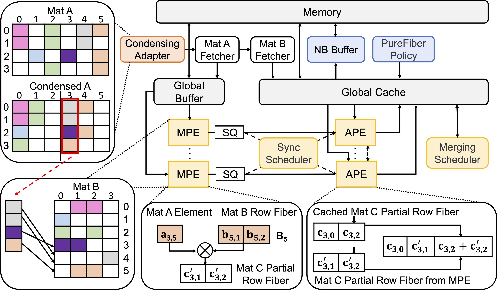
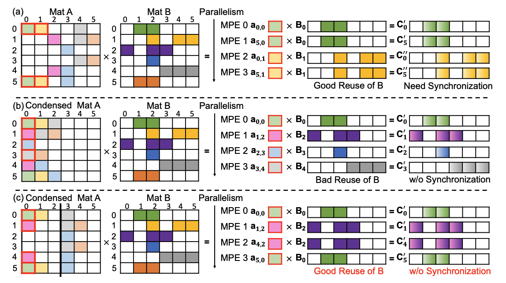
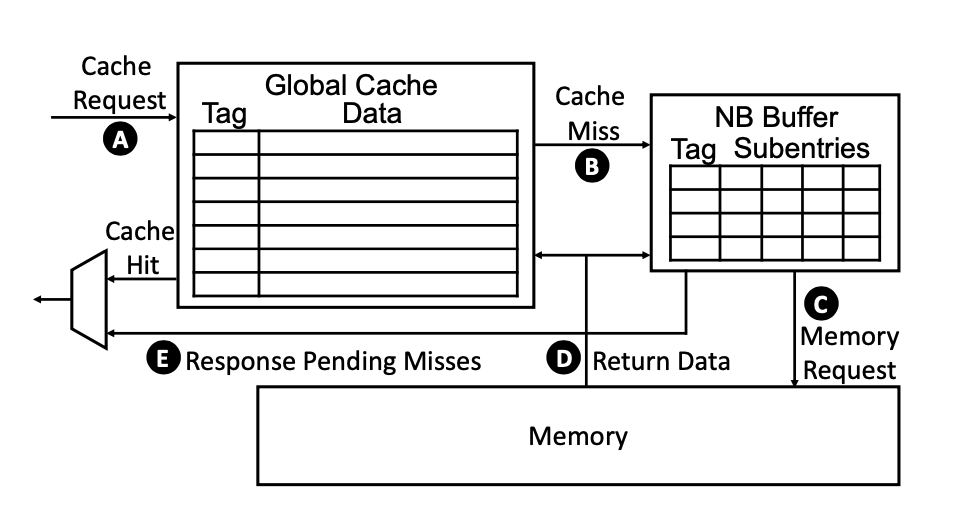
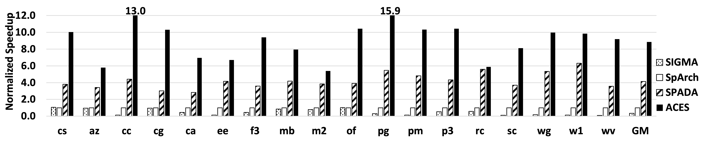

## Background

As AI applications grow in complexity, they require hardware architectures capable of handling massive memory demands and complex computations. Efficient processing of sparse data structures, especially in sparse matrix operations, is essential in many AI and scientific computing tasks. However, traditional architectures often struggle with the data movement overhead and irregular memory access patterns inherent in these applications.

    

## Design

The ACES accelerator addresses these challenges through a novel combination of adaptive execution flows and concurrency-aware memory optimizations, specifically designed for Sparse Matrix-Matrix Multiplication. By optimizing both dataflow and memory management, ACES enhances the performance of sparse computations in AI, allowing efficient processing of data-intensive workloads.

    
    
<em>Overview of the ACES Accelerator Design</em>

## Key Features

- **Adaptive Execution Flow**: Dynamically adjusts execution flows based on input sparsity patterns to optimize parallelism and data reuse.

    
    
<em>Three execution flows with different condensing degrees</em>

- **Balanced Data Reuse and Synchronization**: Balances memory access with parallel execution to maximize data reuse and minimize synchronization overhead.
- **Concurrency-Aware Cache Management**: Employs the PureFiber cache replacement policy, considering reuse distance and concurrent accesses to improve cache performance.
- **Non-Blocking Buffer Integration**: Uses a non-blocking buffer to handle cache misses without stalling the pipeline, enhancing concurrency.

    
    
<em>Organization of the non-blocking cache</em>

## Results

ACES achieves substantial improvements over traditional architectures, demonstrating significant performance gains in AI workloads that rely on sparse matrix computations. Experimental results show up to a 2.1× speedup.

    
    
<em>Performance comparison among SIGMA, SpArch, SPADA, and ACES</em>

## Conclusion

By integrating advanced dataflow and concurrency-aware memory optimizations, ACES provides a high-performance, scalable solution for handling the demands of modern AI applications. These innovations contribute to the overall efficiency and scalability of AI hardware, positioning ACES as a foundational component in the future of AI computing.

[paper](../files/ASPLOS2024/ACES_paper.pdf) [slides](../files/ASPLOS2024/ACES_slides.pdf) [poster](../files/ASPLOS2024/ACES_poster.pdf)
