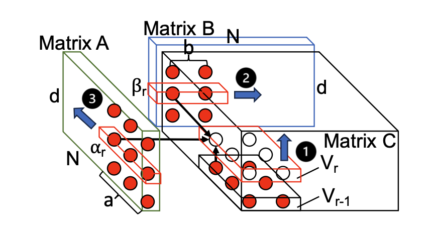
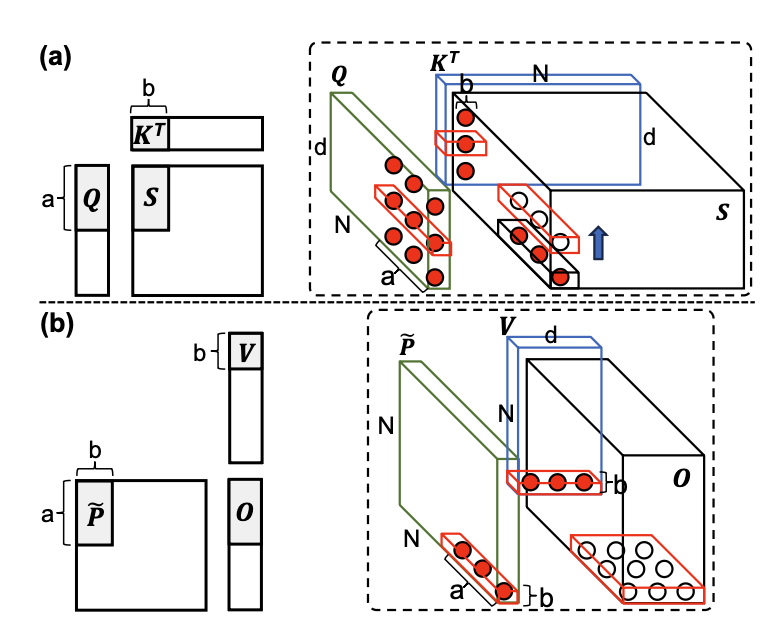

## Background

Long-sequence self-attention is a core component of modern large language models, but its quadratic memory complexity makes data movement (I/O) the dominant performance bottleneck. As sequence length grows, exact attention incurs massive I/O traffic between on-chip and off-chip memory.

Existing acceleration approaches such as FlashAttention and FLAT reduce I/O through tiling and recomputation, but their tiling sizes and scheduling strategies are largely heuristic. Without a systematic I/O analysis that considers matrix dimensions and hardware constraints, these methods cannot guarantee I/O optimality.

## Design

AttenIO introduces a principled I/O analysis framework for long-sequence attention and builds an accelerator guided entirely by that analysis.

First, the work derives the I/O lower bound for tall-and-skinny matrix multiplication using the Red-Blue Pebble Game model. This analysis determines analytically optimal tiling sizes and scheduling strategies that maximize the compute-to-I/O ratio under on-chip memory constraints.

    
    
<em>CDAG of a tall-and-skinny MMM with optimized scheduling to minimize I/O operations. </em>

    
    
<em>I/O-optimal CDAGs for long-sequence attention (a) computation of attention scores (𝑆) with immediate reuse of partial results, and (b) computation of outputs (𝑂)</em>

Based on this I/O analysis, AttenIO implements:
- An I/O-optimal dataflow (tiling + scheduling) for exact attention.
- Three-level communication-computation overlapping to hide memory stalls.
- Parallel execution patterns that restructure softmax into element-wise pipelined operations.

The architecture integrates a controller, PE array, EXP unit, KV buffer, and on-chip cache to realize these I/O-driven optimizations in hardware.

## Key Features

- **Systematic I/O Analysis**: Derives the I/O lower bound for tall-and-skinny MMM and extends it to exact long-sequence attention.
- **I/O-Optimal Tiling and Scheduling**: Analytically minimizes off-chip data movement.
- **Three-Level Overlapping**: Intra-inner, inter-inner, and inter-outer iteration overlapping to reduce stall time.
- **Parallel Softmax Execution**: Converts row-wise dependencies into element-wise parallel patterns for higher utilization.
- **Hardware-Realized Design**: Implements the I/O-driven optimizations in a dedicated accelerator architecture.

## Results

AttenIO consistently outperforms state-of-the-art exact attention implementations:
- 8.8× speedup over FLAT.
- 2.5× speedup over Standard attention.
- 1.6× speedup over FlashAttention-2.
- Reduces data movement by up to 273× compared to heuristic baselines.

## Conclusion

AttenIO demonstrates that systematic I/O analysis provides a principled foundation for optimizing long-sequence attention. By deriving I/O-optimal tiling and integrating communication-computation overlapping with parallel softmax execution, AttenIO significantly reduces data movement and improves hardware utilization. This work highlights the broader potential of I/O analysis as a design methodology for data-intensive accelerator architectures.

[paper](../files/ASPLOS2026/ASPLOS2026.pdf)
