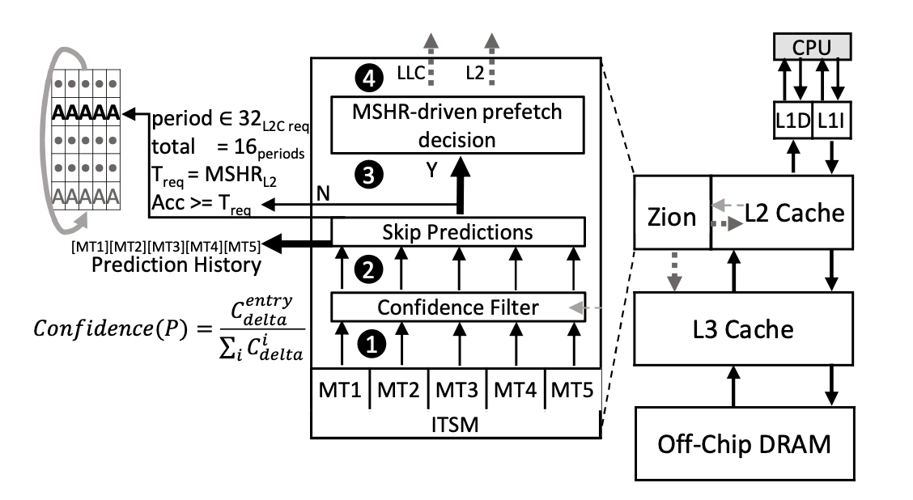

## Background

Memory-intensive workloads increasingly dominate modern systems. In particular, self-attention mechanisms introduce quadratic memory complexity, leading to frequent data movement between on-chip caches and off-chip DRAM.

Traditional hardware prefetchers aim to hide memory latency, but they often struggle with diverse and evolving access streams. Unified prediction tables suffer from entry conflicts, confidence bias, and limited adaptability under memory pressure, which reduces their effectiveness in multicore and attention-heavy environments.

## Design

To address these challenges, Zion introduces a comprehensive and adaptive L2 hardware prefetcher built around Independent Temporal-Spatial Modules (ITSM). This segmented design reduces inter-stream conflicts and improves pattern coverage. In addition, Zion integrates runtime feedback mechanisms including confidence filtering, periodic accuracy monitoring, and MSHR-aware control to dynamically regulate prefetch aggressiveness and insertion behavior under memory pressure.

    
    
<em>Overview of Zion</em>

## Key Features

- **Independent Temporal-Spatial Modules (ITSM)**: Segmented delta and stride predictors for comprehensive coverage of diverse memory patterns.
- **Runtime Adaptation**: Confidence-based filtering and periodic effectiveness monitoring to maintain accuracy.
- **MSHR-Aware Control**: Dynamically adjusts prefetch behavior based on L2 resource availability.
- **Lightweight and Practical**: Requires approximately 9KB storage and integrates at the L2 cache level.

## Results

Zion consistently outperforms state-of-the-art prefetchers including IPCP, Bingo, SPP, and Berti:
- Up to 43.2% speedup on SPEC workloads in a 4-core configuration.
- Up to 43.0% speedup on self-attention workloads.
- Achieves 90.5% LLC miss coverage on LLM attention workloads in 4-core.
- Improves heterogeneous 4-core mixes by 63.8% on average over no prefetching.

## Conclusion

Zion introduces a lightweight yet highly adaptive hardware prefetcher tailored for modern memory-intensive and attention workloads. By combining segmented prediction with runtime feedback control, it delivers strong performance improvements with modest hardware overhead, making it a practical enhancement for multicore CPUs and on-device LLM inference.

[paper](../files/DATE2026/DATE2026.pdf)
