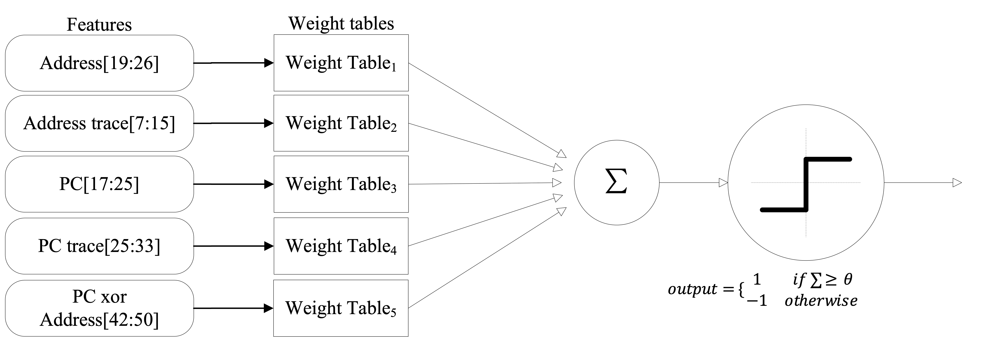

Yuping Wu, <b>Xiaoyang Lu</b>, Xiaoming Chen, Yinhe Han, Xian-He Sun

## Background

As processor speeds continue to rise, the growing gap between compute and memory access makes cache performance increasingly critical. Traditional cache replacement policies rely heavily on data locality, but they often ignore the concurrency of memory accesses. In reality, modern cache architectures support concurrent data accesses, where the cost of a cache miss can vary significantly depending on overlap with other accesses.

## Design

To address this, CAMP (Concurrency-Aware Miss Cost Predictor) introduces a perceptron-based model that enhances traditional locality-based cache replacement by estimating the cost of cache misses under concurrent access. By leveraging multiple correlated features, CAMP dynamically predicts the Pure Miss Contribution (PMC) of a cache block—providing a concurrency-aware signal to guide more effective eviction decisions.

    
    
<em>Overview of the CAMP predictor</em>

## Key Features

- **Perceptron-Based Prediction**: Uses multiple program features to predict whether the PMC of an incoming block is above average.
- **Adaptive Online Learning**: Continuously updates predictions at runtime to adapt to diverse workloads.
- **Concurrency-Driven Cache Decisions**: Enhances traditional policies (e.g., SHiP++) by selecting the least critical victim among blocks with poor locality.
- **Lightweight & General**: Adds just ~5KB overhead and integrates easily with any locality-based policy.

## Results

CAMP demonstrates superior prediction accuracy (~90.4%) and significantly boosts cache efficiency. It improves performance over LRU by:
- 7.1% on SPEC 1-core workloads,
- 12.6% on SPEC 4-core homogeneous workloads,
- 11.0% on SPEC 4-core heterogeneous workloads,
- 10.7% on GAP 4-core homogeneous workloads.

## Conclusion

CAMP introduces a lightweight yet effective way to make cache replacement concurrency-aware by predicting the real performance impact of cache misses. It is compatible with existing policies like SHiP++ and demonstrates strong improvements with modest hardware cost—making it a practical enhancement for modern multicore memory systems.

[paper](../files/GLSVLSI2025/GLSVLSI2025.pdf)
