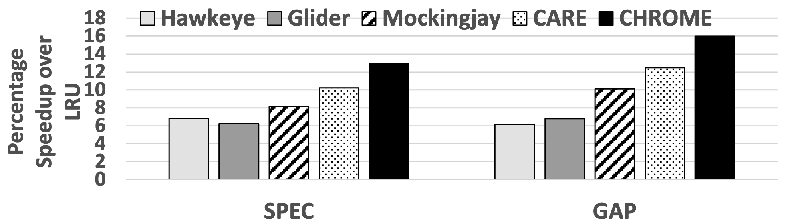

## Background

As data-intensive workloads continue to grow, cache management techniques—such as replacement, bypassing, and prefetching—are essential but are often treated independently. CHROME integrates these techniques using an online reinforcement learning framework to achieve a cohesive cache management strategy.

## Design

CHROME aims to bridge the gap between separate cache management techniques by leveraging reinforcement learning to optimize cache actions dynamically. By monitoring both data locality and concurrency, CHROME adapts to diverse workloads and system configurations in real time.

    
    
<em>Overview of CHROME Design</em>

## Key Features

- **Holistic Cache Management**: Combines cache replacement, bypassing, and prefetching to optimize cache usage.
- **Online Reinforcement Learning**: Employs reinforcement learning to continually adjust cache decisions based on observed workload characteristics, improving adaptability.
- **Concurrency-Aware System Feedback**: Provides CHROME with system-level feedback, enhancing its ability to make accurate cache management decisions.

## Results

CHROME outperforms existing cache management schemes, achieving a 13.7% performance improvement over the LRU baseline in 16-core systems and consistently surpassing competing frameworks in diverse workloads.

    
    
<em>Performance comparison among Hawkeye, Glider, Mockingjay, CARE, and CHROME</em>

## Conclusion

CHROME’s holistic and adaptive approach demonstrates the benefits of combining multiple cache management strategies through reinforcement learning, underscoring its potential as a versatile solution for high-performance computing systems.

[paper](../files/HPCA2024/CHROME_paper.pdf) [slides](../files/HPCA2024/CHROME_slides_updates.pdf) [poster](../files/HPCA2024/CHROME_poster_final.pdf) [code](https://github.com/Xiaoyang-Lu/CHROME/tree/main)
