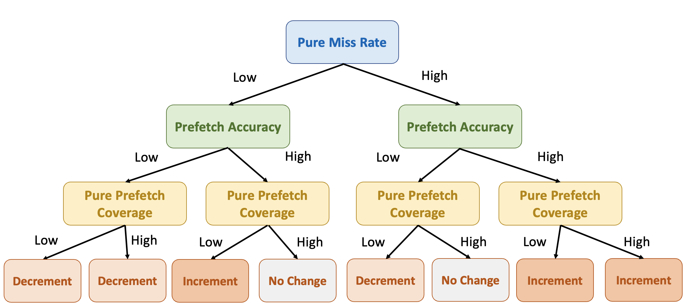
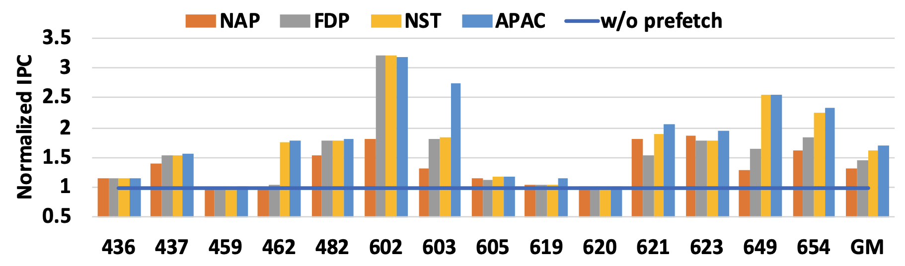

## Background

The "Memory Wall" problem continues to challenge modern processors as memory access times lag behind processor speeds, causing significant stalls in data-intensive applications. Traditional prefetching techniques address this issue partially but are limited in exploring the impact of concurrent memory accesses on prefetching effectiveness.

## Design

To address this gap, APAC introduces Pure Prefetch Coverage (PPC), a novel metric designed to evaluate prefetch effectiveness in high-concurrency environments. By assessing pure misses—cache misses that cannot overlap with hits—PPC enables APAC to capture prefetching effectiveness accurately. PPC guides the adaptive fine-tuning of prefetching strategies, resulting in more accurate and efficient data fetching under concurrent access conditions.

    
    
<em>Adjuct prefetch aggressiveness with runtime metrics</em>

## Key Features

- **Pure Prefetch Coverage (PPC)**: An advanced metric that captures the impact of concurrent memory accesses on prefetch effectiveness, allowing precise control over prefetch aggressiveness.

    

- **Adaptive Prefetch Tuning**: APAC dynamically adjusts prefetching intensity based on real-time feedback from PPC, Pure Miss Rate (pMR), and Prefetch Accuracy (PA), optimizing cache performance across varying memory access patterns.

## Results

In both single-core and multi-core environments, APAC demonstrates substantial performance improvements. Single-threaded benchmarks see an average 17.3% IPC gain, while multi-core systems achieve an 8.5% IPC increase over state-of-the-art adaptive frameworks.

    
    
<em>Performance comparison among NAP, FDP, NST, and APAC</em>

## Conclusion

APAC’s concurrency-aware approach to prefetching highlights the performance benefits of measuring and leveraging memory access concurrency, making it a highly effective solution for optimizing data-intensive applications in multi-core systems.

[paper](../files/ICCD2020/APAC_paper.pdf)
