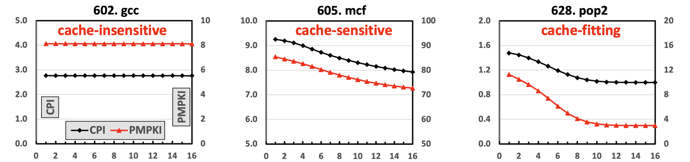
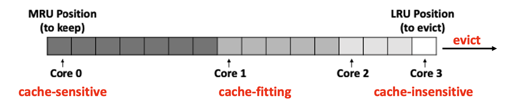
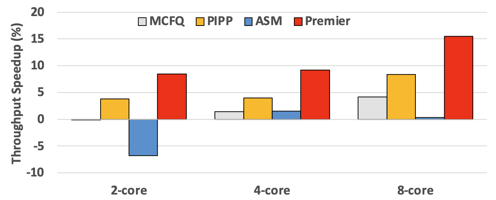

## Background

As multi-core processors handle increasingly complex applications, shared last-level caches (LLCs) experience contention, leading to performance degradation. Cache partitioning can mitigate this by controlling cache allocations per core, but it often overlooks concurrency.

## Design

Premier leverages Pure Misses Per Kilo Instructions (PMPKI), a concurrency-aware metric that optimizes cache partitioning decisions by assessing the real cost of cache misses under concurrent access. By focusing on pure misses rather than total misses, Premier improves both performance and fairness across workloads.

    

## Key Features

- **Pure Misses Per Kilo Instructions (PMPKI)**: Assesses cache miss impact in concurrent access scenarios, providing an effective indicator for partitioning decisions.

    

- **Dynamic Cache Allocation**: Using PMPKI curves, Premier adapts cache allocation in real-time, balancing between performance and fairness for each application in multi-core setups.

    

## Results

Premier outperforms traditional partitioning schemes, achieving a 15.45% performance improvement and a 10.91% fairness increase in 8-core systems, demonstrating its strength in managing shared LLC resources effectively.

    
    
<em>Throughput with varying core count</em>

## Conclusion

Premier’s concurrency-aware approach to cache partitioning highlights the importance of pure misses in optimizing cache efficiency, especially in scenarios with high core counts and shared resources.

[paper](../files/ICCD2021/Premier_paper.pdf)
