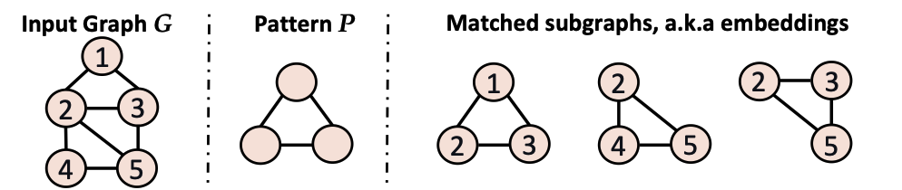
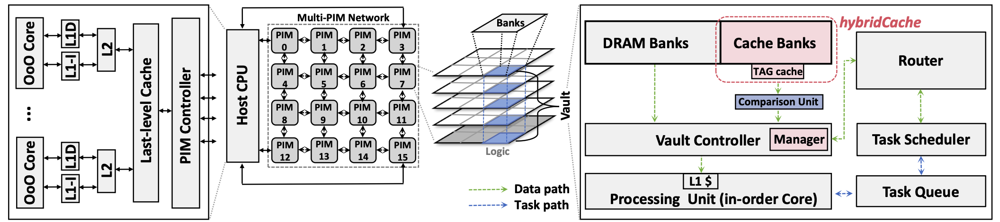
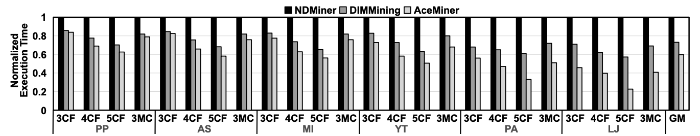

Liang Yan, <b>Xiaoyang Lu</b>, Xiaoming Chen, Sheng Xu, Xingqi Zou, Yinhe Han, Xian-He Sun

## Background

Graph pattern matching (GPM) is critical in domains like bioinformatics and web analytics but often encounters memory bottlenecks due to frequent data transfers and irregular access patterns. Existing PIM solutions are limited in handling GPM's unique memory demands, resulting in underutilized locality and excessive data movement.

    
    
<em>Overview of GPM algorithm</em>

## Design

AceMiner introduces a hardware-software co-designed PIM framework to address these limitations, featuring an in-DRAM caching system optimized for GPM locality, and an embedded comparison unit to minimize redundancy in GPM computations. Together, these innovations reduce data movement and enhance cache management, boosting the performance of memory-bound GPM workloads.

    
    
<em>Overall AceMiner system architecture</em>

## Key Features

- **HybridCache**: An in-DRAM cache system with a custom replacement policy tailored to GPM's locality demands, effectively reducing internal PIM data transfers.
- **Advanced Replacement Policy**: Manages the irregular memory access patterns typical in GPM applications.
- **Optimized Comparison Unit**: Reduces redundant memory loads by filtering data based on GPM-specific constraints, thus lowering the overall memory footprint.

## Results

AceMiner achieves a 40.2% speedup over the NDMiner framework and a 13.3% improvement over DIMMining, with lower energy consumption, demonstrating its effectiveness in high-throughput graph applications.

    
    
<em>Performance comparison of state-of-the-art frameworks</em>

## Conclusion

AceMiner demonstrates that by integrating a cache system and comparison unit within PIM, it’s possible to achieve high performance in data-intensive graph applications, setting a benchmark for future GPM-oriented PIM designs.

[paper](../files/ICCD2024/AceMiner_paper.pdf) [slides](../files/ICCD2024/AceMiner_slides.pdf)
