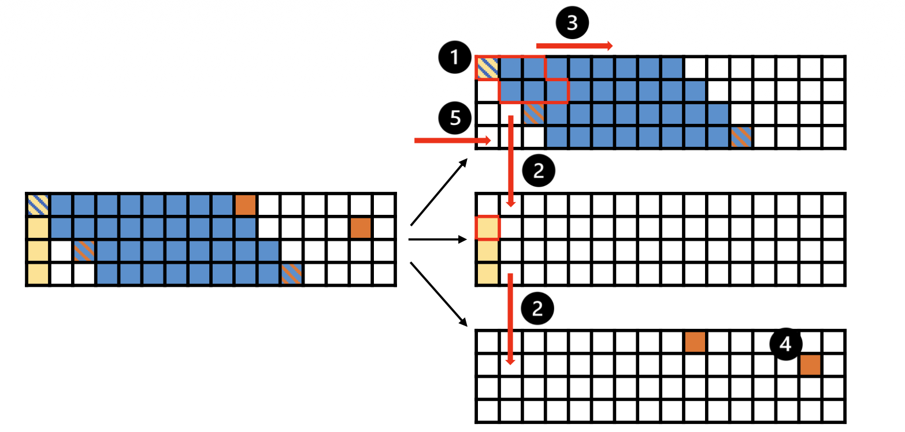

<b>Xiaoyang Lu</b>, Lihan Hu, Hongrui Huang, Peng Jiang, Xian-He Sun

## Background

As sequence lengths grow in LLM inference, attention increasingly becomes the dominant performance bottleneck.
While sparsity reduces computation, it exposes severe data movement overhead between GPU cores and off-chip memory. Processing-in-Memory architectures can reduce external data movement, but naive offloading introduces substantial internal data movement between on-chip buffers and DRAM inside PIM. Therefore, both external and internal I/O become critical bottlenecks.

## Design

To address these challenges, PILOT is proposed as a Processing-in-Memory based, I/O-aware software and hardware co-design targeting memory-bound attention computations. At the hardware level, PILOT integrates lightweight processing units inside HBM to execute hybrid sparse attention during the prefill stage and both dense and sparse attention during decoding, thereby reducing costly data movement between GPU and memory.

At the software level, PILOT is guided by a detailed I/O analysis that characterizes data reuse and buffer constraints. This analysis derives buffer-aware tiling and scheduling strategies that maximize the compute-to-I/O ratio and minimize internal data movement between local SRAM buffers and DRAM within the PIM hierarchy.

Finally, a GPU-PILOT heterogeneous system is constructed in which compute-intensive kernels remain on the GPU while memory-bound attention is offloaded to PILOT. This coordinated execution provides an efficient end-to-end solution for long-sequence LLM inference.

    
    
<em>Per-bank $Q$-stationary scheduling for SDDMM in sparse attention during the prefill stage for non-global rows</em>

## Key Features

- **Hybrid Sparse Attention Support in Prefill**: Extends PIM acceleration beyond decoding by efficiently supporting memory-bound hybrid sparse attention during the prefill stage.
- **I/O-Aware Tiling and Scheduling**: Leverages rigorous I/O analysis to derive buffer-aware tiling and scheduling strategies that maximize the compute-to-I/O ratio under limited SRAM capacity within the PIM architecture.
- **GPU-PIM Heterogeneous Execution**: Offloads memory-bound attention to PIM while retaining compute-intensive kernels on the GPU, enabling balanced and efficient end-to-end execution.

## Results

PILOT consistently outperforms both GPU and prior GPU-PIM baselines across prefill, decoding, and end-to-end inference:
- Up to 19.96× speedup over GPU for hybrid sparse attention in the prefill stage.
- Up to 57.11× speedup over GPU for attention in the decoding stage.
- Up to 2.71× speedup over AttAcc in end-to-end long-sequence LLM inference.

## Conclusion

PILOT is a PIM-based, I/O-aware software-hardware co-design for accelerating memory-bound attention computations during long-sequence LLM inference. At the software level, a comprehensive I/O analysis is performed to derive optimized tiling and scheduling strategies tailored to hybrid sparse attention in the prefill stage and attention computations in the decoding stage. At the hardware level, computational units are strategically integrated within the memory hierarchy to support efficient near-memory execution. Extensive evaluations demonstrate that PILOT significantly improves performance and substantially reduces internal I/O overhead for memory-bound attention operations. The detailed I/O analysis provides a principled foundation for future architectures designed to efficiently handle workloads with irregular data access patterns.

[paper](../files/IPDPS2026/IPDPS2026.pdf)
